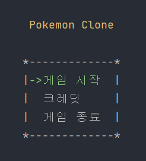

# CLONE POKEMON
> 콘솔로 할 수 있는 포켓몬 게임을 제작했습니다.

## 게임 구조
### Player
- 나는 **포켓몬 트레이너**로, 4마리의 몬스터를 소지할 수 있습니다.
- 맵을 돌아다닐 수 있습니다.
- 몬스터로 배틀에서 공격과 회복 기능을 사용할 수 있습니다.

### Moster
- 각 몬스터마다 이름, HP, MP, 속성, 공격력 정보가 존재합니다.
- 속성에 따라서 공격할 때 자속 보정이 적용됩니다.
- 속성마다 스킬이 있습니다.

## Scene

### Map
- 맵 영역에서 플레이어를 이동시킬 수 있습니다.
- 풀숲에서 야생의 몬스터와 배틀에 돌입합니다.
- 배틀 확률은 걸음수에 따라 올라갑니다.
- 배틀이 끝나면 확률이 0%으로 초기화 됩니다. 

### Battle
- 턴당 플레이어 1회 행동, 몬스터 1회 행동이 주어집니다.
- 몬스터를 교체할 수 있습니다.
- 몬스터의 HP가 0이되면 더 이상 전투에서 사용할 수 없습니다.
- 소지한 몬스터 전부 HP가 0이 되면 게임이 종료됩니다.  

## 조작키
### 캐릭터 움직임
→ ← ↑ ↓ : 이동
A W S D : 이동

### 전투
1, 2, 3, 4: 몬스터 선택
→ ←: 메뉴 이동
Enter: 선택

# 코드 구조
├── 📂 Manager 
│   ├── GameManager.cs 
│   ├── BattleManager.cs 
│   ├── SceneManager.cs 
│   └── InputManager.cs 
├── 📂 GameObjects 
│   ├── 📂 Entities 
│   │   ├── Player.cs 
│   │   └── Monster.cs 
├── 📂 Scenes 
│   ├── Scene.cs (interface) 
│   ├── MainMenusScene.cs 
│   ├── FieldScene.cs 
│   └── BattleScene.cs 
├── 📂 Utils 
│   ├── 📂 UI 
│   │   ├── Menus.cs 
│   │   ├── Vector.cs 
│   │   ├── ScreenArea.cs 
│   │   ├── TileArea.cs 
│   └── 📂 Helpers 
│       ├── PrintText.cs 
│       └── Debug.cs 
└── Program.cs